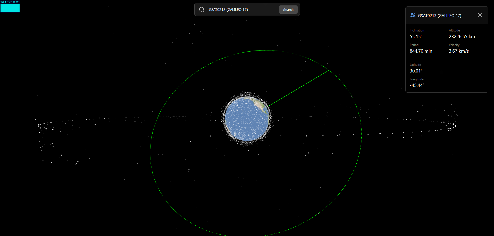

# Satellite Visualization

This project is a 3D visualization of Earth and its satellites using Three.js. It provides an interactive view of Earth with real-time satellite positions based on TLE (Two-Line Element set) data.



## Installation

1. Clone the repository:
   ```
   git clone https://github.com/ErgunYavuz/Satellite-tracker.git
   ```

2. Navigate to the project directory:
   ```
   cd satellite-visualization
   ```

3. Install dependencies:
   ```
   npm install
   ```

4. Start the development server:
   ```
   npm run dev
   ```

## Usage

- Use mouse controls to rotate, zoom, and pan the view.
- Click on a satellite to display its information and trajectory.
- The info panel on the top right shows details about the selected satellite.

## Dependencies

- Three.js
- Satellite.js
- Stats.js